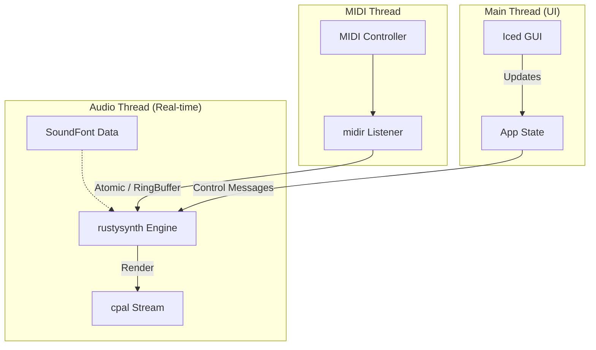

# Piano App Architecture Blueprint

## 1. Project Overview
**Goal**: Create a simple, low-latency, multiplatform piano application driven by an 88-key MIDI controller.
**Target Platforms**: macOS 13 (Apple Silicon) for development, macOS 10 (Intel) for testing. The application must also support **Linux** and **Windows**.
**Licensing**: Fully Open Source.

## 2. Technology Stack Selection
We recommend **Rust** for this project. It offers memory safety, excellent performance (crucial for real-time audio), and a modern build system that simplifies cross-compilation for different macOS architectures.

### Core Components
| Component | Library (Crate) | Reason |
|-----------|-----------------|--------|
| **Language** | **Rust** | Zero-cost abstractions, predictable performance, great tooling. |
| **Audio I/O** | **`cpal`** | The standard for low-level audio access in Rust. Cross-platform (CoreAudio on Mac). |
| **MIDI Input** | **`midir`** | Robust, cross-platform MIDI handling. |
| **Synthesis** | **`rustysynth`** | A high-performance SoundFont synthesizer written in pure Rust. Eliminates the need for complex C-bindings (like FluidSynth) and simplifies distribution. |
| **GUI** | **`iced`** | A simple, type-safe, cross-platform GUI library inspired by Elm. Perfect for a "very simple" app. |
| **Assets** | **SoundFonts (.sf2)** | Standard format for sampled instruments. We will use a high-quality free piano SoundFont (e.g., *Salamander Grand* or a lighter General MIDI font). |

## 3. Architecture Design

The application will use a multi-threaded architecture to ensure audio stability and UI responsiveness.

### Data Flow
1.  **Initialization**:
    *   Load SoundFont into memory (Arc).
    *   Initialize `rustysynth` engine.
    *   Start `cpal` audio stream.
    *   Start `midir` input listener.
2.  **MIDI Input**:
    *   User presses key -> MIDI Note On event.
    *   `midir` callback receives event.
    *   Event is pushed to a **Lock-Free Ring Buffer** (e.g., `rtrb`) to safely cross to the Audio Thread without blocking.
3.  **Audio Processing**:
    *   `cpal` requests audio buffer.
    *   Audio thread pops MIDI events from Ring Buffer and applies them to `rustysynth`.
    *   `rustysynth` renders samples.
    *   Samples are written to output buffer.

## 4. Cross-Platform & Legacy Support
### macOS 10 (Intel) vs macOS 13 (Silicon)
*   **Rust Support**: Rust's `std` library supports macOS 10.12+ officially (tier 1). For older versions (10.7+), it usually works but might require setting `MACOSX_DEPLOYMENT_TARGET`.
*   **Universal Binaries**: We can build for both `aarch64-apple-darwin` and `x86_64-apple-darwin`.
*   **Testing**:
    *   **Dev**: Run natively on M1.
    *   **Test**: Build `x86_64` binary on M1 (via Rosetta or cross-compilation) and deploy to the Intel Mac.

## 5. Development Roadmap
1.  **Proof of Concept (CLI)**: Play a tone using `cpal` + `rustysynth` when a key is pressed (no UI).
2.  **MIDI Integration**: Connect `midir` to trigger the synth.
3.  **UI Implementation**: Add `iced` window to select MIDI device and SoundFont.
4.  **Packaging**: Bundle as `.app` for distribution.
5.  **Cross-Platform Distribution**: Compile and package for Windows (MSI/EXE) and Linux (Deb/RPM/Flatpak).
